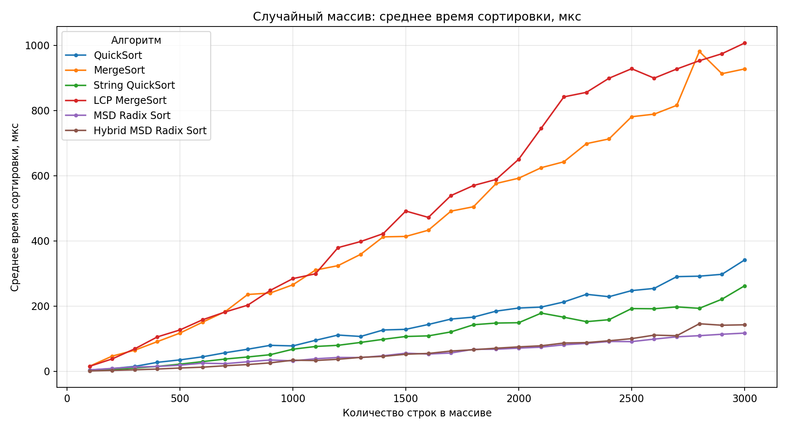
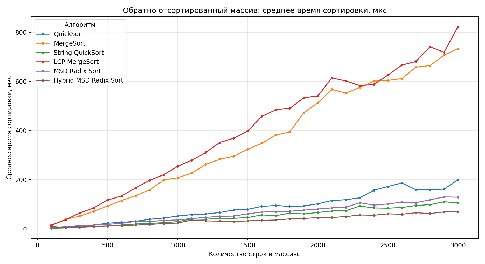
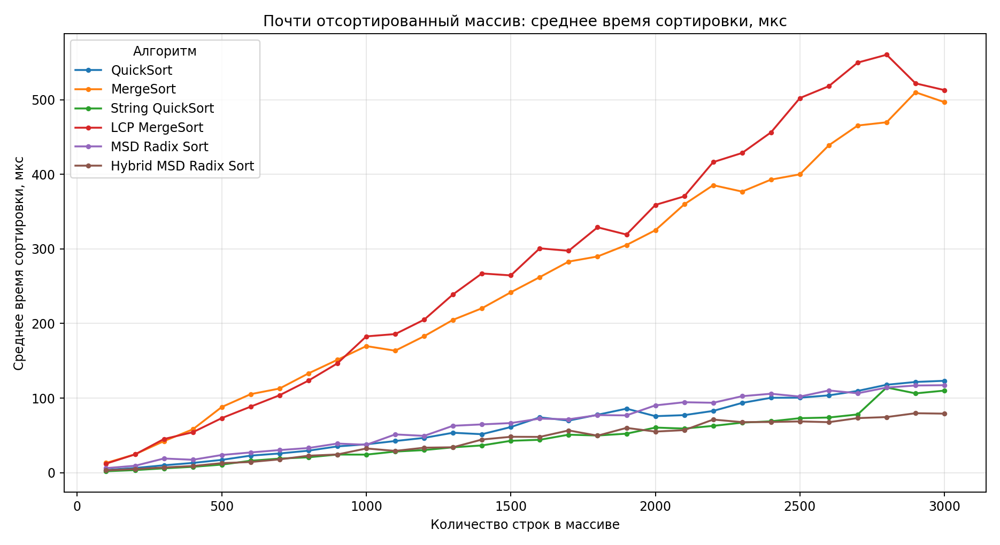
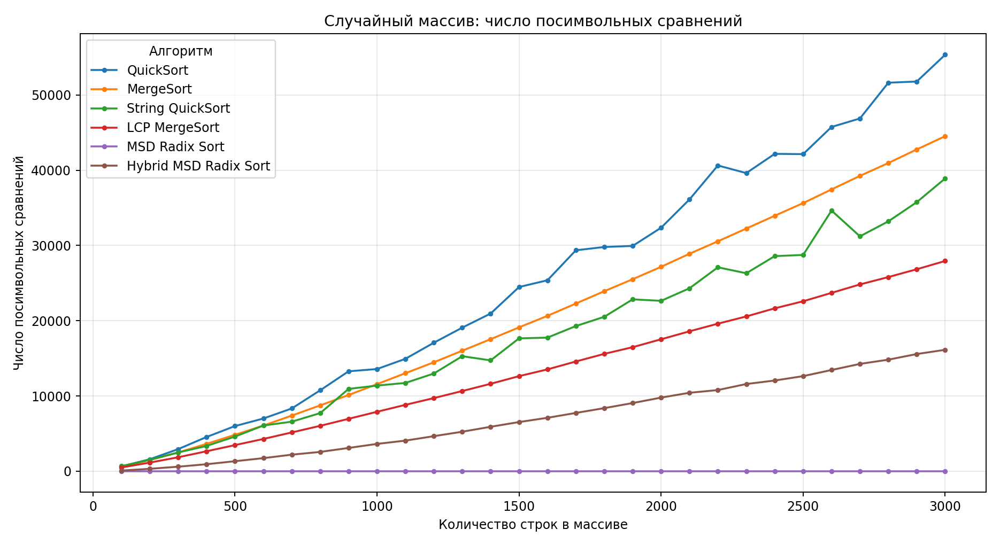
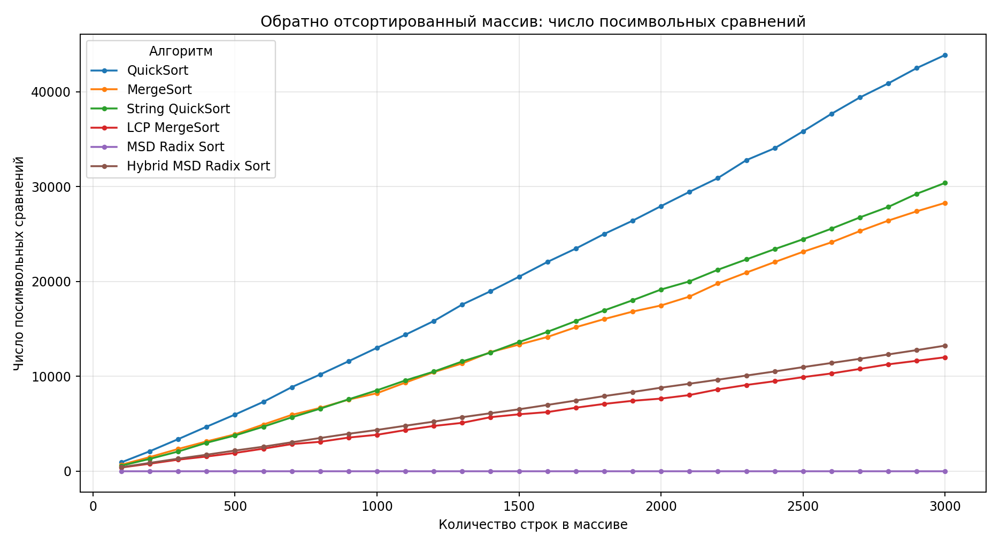
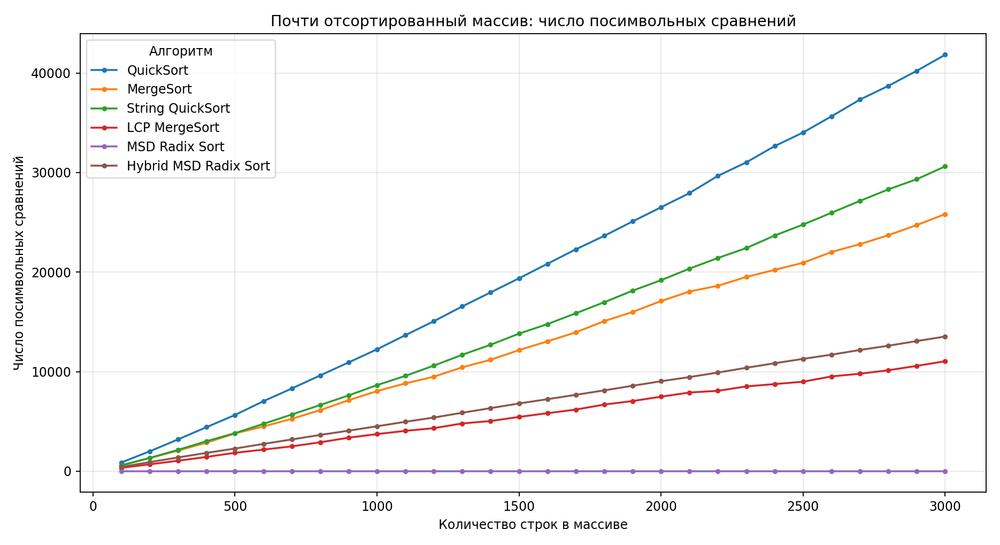
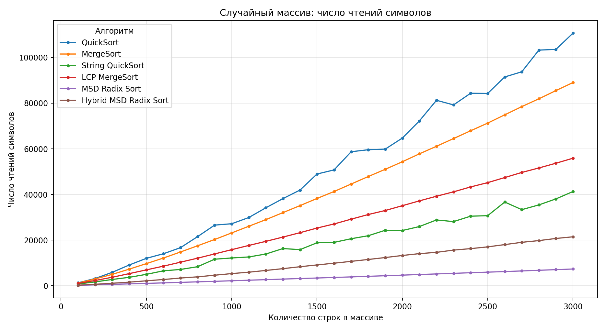
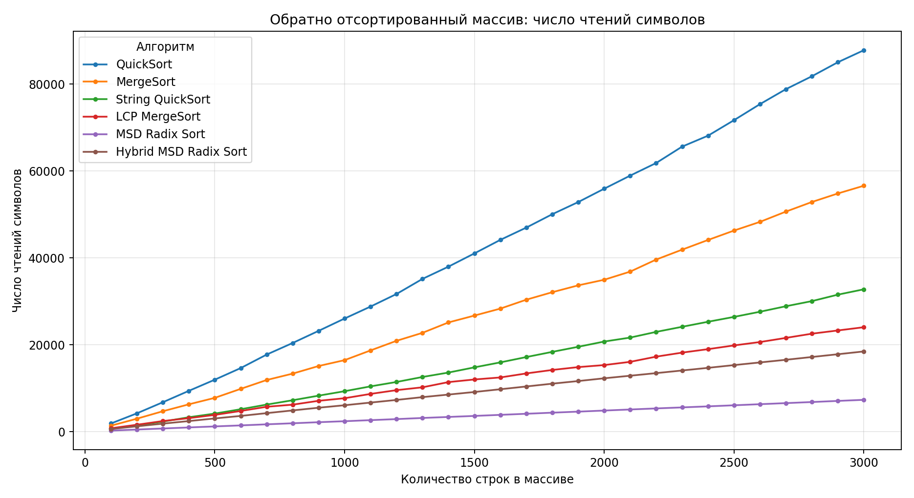
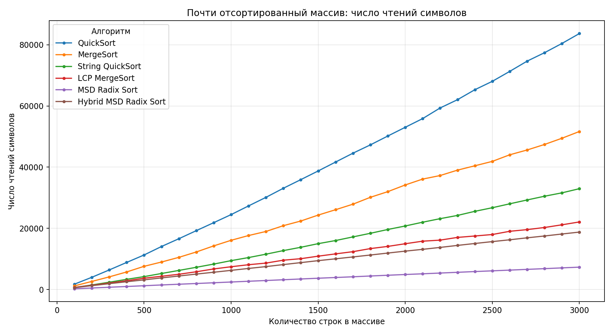

# Анализ алгоритмов сортировки строк

> Автор: Положенко Виталий, БПИ-247

## 1. Реализованные классы

### 1.1. Класс `StringGenerator`

`StringGenerator` формирует максимальные массивы по 3000 строк. Длина каждой строки выбирается в диапазоне от 10 до 200 символов.

Для каждого типа данных сначала создаётся массив длины 3000, после чего для эксперимента берутся его префиксы длиной 100, 200, ..., 3000 строк.

### 1.2. Класс `StringSortTester`

- запускает каждый алгоритм на каждом наборе и размере входа;
- выполняет многократные измерения времени;
- проверяет корректность сортировки сравнением с результатом `std::sort`;
- сохраняет данные в `results/results.csv`.

## 2. Наборы тестовых данных

1. **Случайный массив** (`random`) - полностью случайный массив строк.
2. **Обратно отсортированный массив** (`reverse`) - строки того же расположены в обратном лексикографическом порядке.
3. **Почти отсортированный массив** (`nearly_sorted`) - отсортированный массив, в котором выполняется одна соседняя перестановка в каждом блоке из 100 элементов.

## 3. Методика измерений

Файл `results/results.csv` содержит следующие показатели:

| Поле | Смысл |
|---|---|
| `mean_us`, `median_us`, `stddev_us` | Среднее, медианное время и стандартное отклонение времени сортировки в микросекундах. |
| `char_comparisons` | Число сравнений двух реально существующих символов строк. |
| `char_accesses` | Число чтений символов строк; дополнительная метрика для анализа MSD Radix Sort. |
| `sorted_ok` | Результат автоматической проверки корректности сортировки. |

## 4. Результаты эксперимента

Результаты ниже получены запуском с параметрами `--repetitions 10` и `--seed 20269999`.

### 4.1. Результаты при размере массива `n = 3000`

#### Число посимвольных сравнений

| Алгоритм | Случайный | Обратно отсортированный | Почти отсортированный |
|---|---:|---:|---:|
| QuickSort | 55 353 | 43 889 | 41 830 |
| MergeSort | 44 529 | 28 296 | 25 827 |
| String QuickSort | 38 911 | 30 401 | 30 618 |
| LCP MergeSort | 27 945 | 12 018 | 11 049 |
| MSD Radix Sort | 0 | 0 | 0 |
| Hybrid MSD Radix Sort | 16 140 | 13 243 | 13 528 |

Относительно обычного MergeSort алгоритм LCP MergeSort уменьшил число посимвольных сравнений:

- на случайном наборе (`random`) — примерно в **1,59 раза**;
- на обратно отсортированном наборе (`reverse`) — примерно в **2,35 раза**;
- на почти отсортированном наборе (`nearly_sorted`) — примерно в **2,34 раза**.

#### Среднее время сортировки, мкс

| Алгоритм | Случайный | Обратно отсортированный | Почти отсортированный |
|---|---:|---:|---:|
| QuickSort | 341.548 | 199.927 | 123.177 |
| MergeSort | 927.524 | 733.584 | 496.837 |
| String QuickSort | 262.301 | 105.638 | 110.023 |
| LCP MergeSort | 1006.837 | 823.021 | 513.019 |
| MSD Radix Sort | **117.327** | 128.839 | 117.257 |
| Hybrid MSD Radix Sort | 142.854 | **69.454** | **79.107** |

В проведённом запуске лучшими по времени оказались MSD-подходы. На случайном наборе (`random`) минимальное среднее время показал MSD Radix Sort, а на обратно отсортированном (`reverse`) и почти отсортированном (`nearly_sorted`) наборах быстрее оказался Hybrid MSD Radix Sort.

Среднее время Hybrid MSD Radix Sort по трём обязательным наборам составило **97.138 мкс**, что является лучшим совокупным результатом среди рассмотренных алгоритмов. При этом LCP MergeSort заметно снижает число сравниваемых символов относительно обычного MergeSort, но не становится быстрее по времени.

### 4.2. Графики времени работы

На графиках приведено изменение среднего времени сортировки при увеличении числа строк от 100 до 3000.

#### Случайный массив (`random`)



#### Обратно отсортированный массив (`reverse`)



#### Почти отсортированный массив (`nearly_sorted`)



### 4.3. Графики числа посимвольных сравнений

#### Случайный массив (`random`)



#### Обратно отсортированный массив (`reverse`)



#### Почти отсортированный массив (`nearly_sorted`)



### 4.4. Дополнительная метрика: число чтений символов

Для MSD Radix Sort сравнения символов не являются полной характеристикой работы, поэтому дополнительно визуализировано число обращений к символам строк.

#### Случайный массив (`random`)



#### Обратно отсортированный массив (`reverse`)



#### Почти отсортированный массив (`nearly_sorted`)



## 5. Вывод

На обязательных наборах данных LCP MergeSort во всех случаях уменьшил количество посимвольных сравнений относительно стандартного MergeSort: в 1.59 раза на случайном наборе, в 2.35 раза на обратно отсортированном и в 2.34 раза на почти отсортированном. Однако это уменьшение не привело к сокращению времени работы, поскольку поддержка LCP-информации требует дополнительных вычислений.

Наименьшее среднее время по трём обязательным наборам в совокупности показал Hybrid MSD Radix Sort — **97.138 мкс**. При этом на случайном наборе быстрее оказался обычный MSD Radix Sort, а Hybrid MSD Radix Sort показал лучший результат на обратно отсортированном и почти отсортированном наборах.
## 6. Сборка

### Linux / macOS / WSL

```bash
cmake -S . -B build
cmake --build build
./build/string_sort_study --output results --repetitions 10 --seed 20269999
python3 analysis/plot_results.py results/results.csv --output results/charts
```

Поддерживаемые параметры программы:

```text
--seed <число>          фиксированный seed генератора
--repetitions <число>   число измеряемых запусков
--output <каталог>      каталог для CSV, сводки и графиков
```